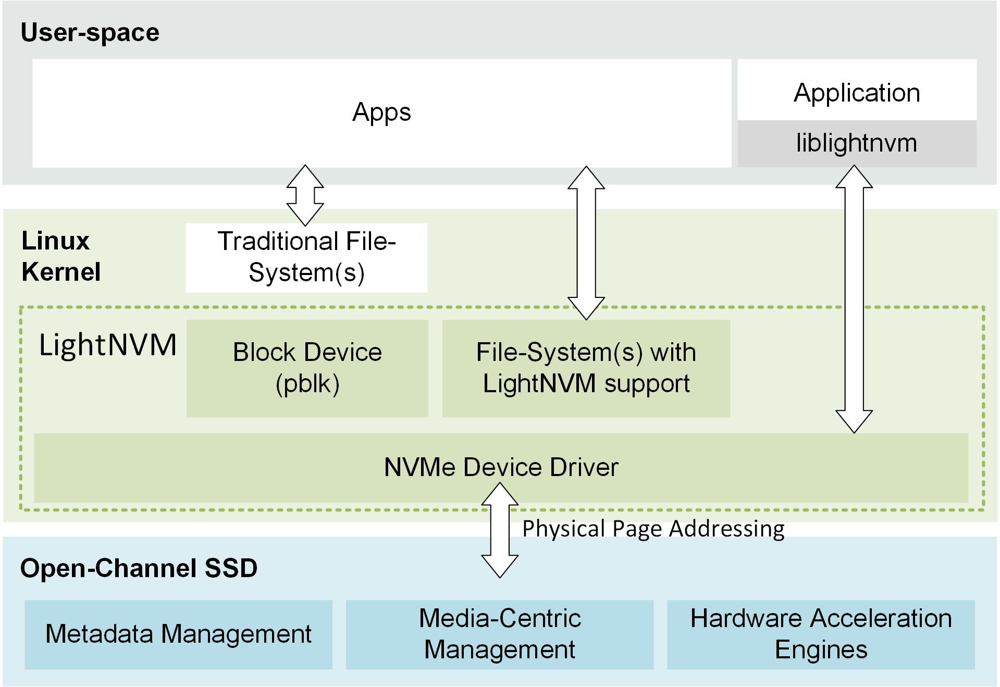
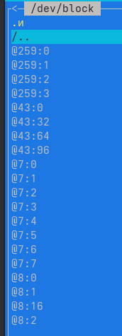
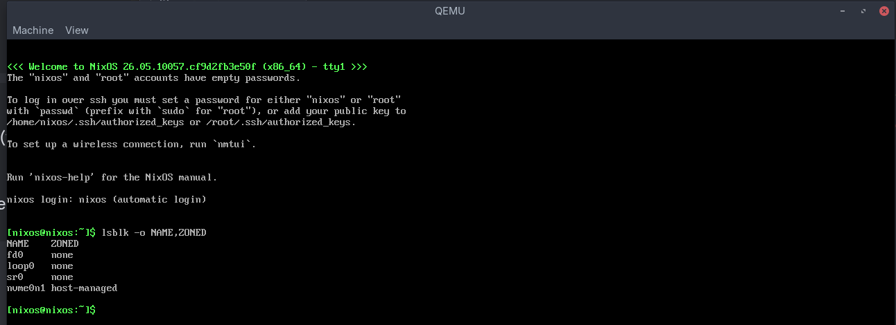
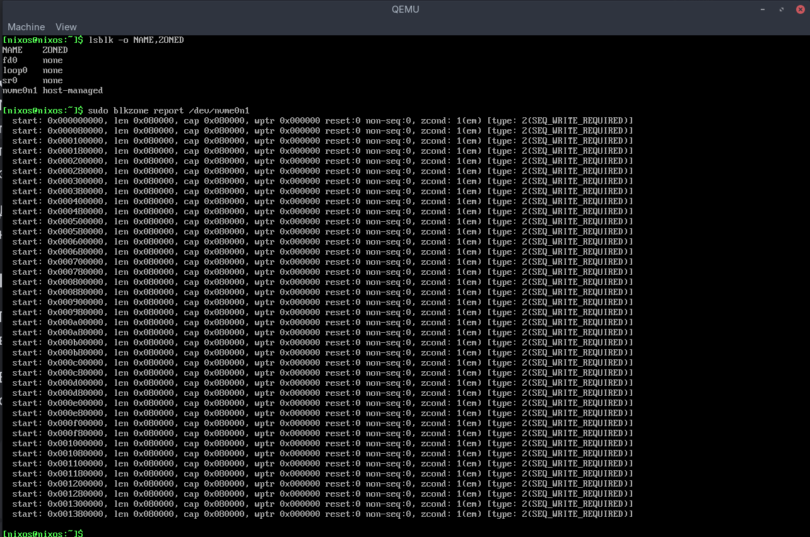

# Твердотельные накопители с открытым каналом
Разработан новый класс твердотельных накопителей (SSD), известных как Open-Channel SSD. Open-Channel SSD отличаются от традиционных SSD тем, что они предоставляют хосту доступ к внутреннему параллелизму SSD и позволяют ему управлять им. Это позволяет Open-Channel SSD обеспечивать хосту три свойства: изоляцию ввода-вывода, предсказуемые задержки и программно-определяемую энергонезависимую память.

## Изоляция ввода/вывода
Изоляция ввода-вывода обеспечивает метод **разделения емкости SSD на несколько каналов ввода-вывода**, которые отображают параллельные блоки устройства (LUN). Это позволяет использовать SSD с открытым каналом в многопользовательских приложениях без взаимного влияния арендаторов (мультитенантность).

## Предсказуемая задержка
Предсказуемая задержка достигается за счет контроля на хосте над тем, когда, где и как операции ввода-вывода отправляются на SSD.

## Программно-определяемая энергонезависимая память
Благодаря интеграции уровня трансляции данных SSD-флэш-памяти в хост-систему, оптимизация рабочих нагрузок может применяться"
- либо в рамках автономного уровня трансляции данных флэш-памяти, 
- либо при интеграции с файловой системой, 
- либо в самих приложениях.


На рисунке показано разделение ответственности между хостом и SSD. 

Хост реализует общие функции FTL: 
- размещение данных, 
- планирование ввода-вывода и 
- сборку мусора; 
- и предоставляет традиционное блочное устройство в пользовательское пространство. 

Обрабатываются контроллером
- Метаданные, ориентированные на носитель, 
- обработка ошибок, 
- очистка и 
- выравнивание износа . 

Таким образом, хост может управлять компромиссами, связанными с:
- пропускной способностью, 
- задержкой, 
- энергопотреблением и 
- емкостью. 
- Такое разделение труда между SSD и хостом позволяет SSD с открытым каналом абстрагироваться от фактического носителя, в то время как хост контролирует все операции ввода-вывода, передаваемые на носитель.

Для использования SSD-накопителя с открытым каналом, стек хранения данных хоста должен поддерживать спецификацию SSD с открытым каналом. Поддержка доступна через:
- Ядро Linux (4.12+)
- nvme-cli (0.8+ )
- liblightnvm (ядро Linux 4.14+)

Когда подсистема NVMe обнаруживает SSD с открытым каналом, он регистрируется в подсистеме "lightnvm".

Ядро реализует записи sysfs для перечисления геометрии SSD через `/dev/block/nvme*/lightnvm/`. Доступ к ним можно получить после загрузки ядра.



Записи @259:0, @259:1 и т.д. — это прямые ссылки на разделы ваших стандартных NVMe-накопителей (или дисков blkext).
- @259:0 — это сам накопитель (эквивалент nvme0n1).
- @259:1, @259:2 — это его подразделы (эквиваленты nvme0n1p1, nvme0n1p2), на которых развернута ваша NixOS.

Это обычные потребительские или корпоративные SSD с классическим аппаратным FTL на борту. Они скрывают от ядра физические каналы и блоки флеш-памяти.

## Как должна выглядеть структура Open-Channel SSD
1. В виртуальной файловой системе sysfs:Параметры LightNVM находятся не в /dev/block, а в каталоге параметров ядра:
```bash
/sys/class/block/nvme0n1/lightnvm/
# или
/sys/block/nvme0n1/lightnvm/
```
Внутри этой папки лежали бы текстовые файлы с геометрией: 
- `num_channels` (количество каналов), 
- `num_lun` (количество кристаллов), 
- `num_blocks` (количество блоков).
2. В /dev:
Появились бы управляющие интерфейсы LightNVM (обычно символьные устройства вроде /dev/lightnvm/control).
**подсистема LightNVM была полностью удалена из основного ванильного ядра Linux, начиная с версии 5.15**

На смену проприетарным и неоптимальным Open-Channel SSD пришла официальная международная спецификация NVMe ZNS (Zoned Namespaces). Она стала частью официального стандарта NVMe (начиная со спецификации NVMe 2.0) и поддерживается в ванильном ядре Linux «из коробки» начиная с версии 5.9

[Zoned Storage](https://zonedstorage.io/docs/tools/zns)
Чтобы узнать, поддерживает ли ваш NVMe-накопитель технологию Zoned Namespaces (ZNS), вам понадобятся стандартные утилиты командной строки Linux.
```bash
lsblk -o NAME,ZONED
# или
nix-shell -p nvme-cli --run "sudo nvme list"
```
выводит:
```bash
[ilya@nixos:~/TestFlashSim/OriginalFlashSim]$ lsblk -o NAME,ZONED
NAME        ZONED
sda         none
├─sda1      none
└─sda2      none
sdb         none
nbd0        none
nbd1        none
nbd2        none
nbd3        none
nvme1n1     none
└─nvme1n1p1 none
nvme0n1     none
└─nvme0n1p1 none

[ilya@nixos:~/TestFlashSim/OriginalFlashSim]$ nix-shell -p nvme-cli --run "sudo nvme list"
[sudo] пароль для ilya:
Node                  Generic               SN                   Model                                    Namespace  Usage                      Format           FW Rev
--------------------- --------------------- -------------------- ---------------------------------------- ---------- -------------------------- ---------------- --------
/dev/nvme0n1          /dev/ng0n1            S465NB0K616439L      Samsung SSD 970 EVO 250GB                0x1          4.99  GB / 250.06  GB    512   B +  0 B   1B2QEXE7
/dev/nvme1n1          /dev/ng1n1            S4EUNM0W407443J      Samsung SSD 970 EVO Plus 250GB           0x1          4.99  GB / 250.06  GB    512   B +  0 B   2B2QEXM7
```

# два пути для экспериментов с ZNS и Open-Channel архитектурами, не покупая дорогое enterprise-железо:
## Вариант 1. Разработка во FlashSim (Уровень исходного кода)
Вы можете смоделировать ZNS прямо внутри текущей папки `~/TestFlashSim/OriginalFlashSim`:
- В файле конфигурации `ssd.conf` вы настраиваете физическую геометрию (блоки, страницы).
- В кодовой базе симулятора вы создаете логическую абстракцию: делите массив блоков на `зоны` и пишете проверку в вашем кастомном FTL-слое, которая выдает ошибку, если тестовый лог (run_trace.cpp) пытается выполнить нераспределенную или непоследовательную запись в рамках зоны.

## Вариант 2. Эмуляция ZNS на уровне ядра NixOS (через QEMU)
Если вам хочется покрутить настоящие утилиты blkzone, nvme-cli и посмотреть, как ядро Linux взаимодействует с зонами, можно запустить виртуальную машину в QEMU, которая создаст эмулированный ZNS NVMe накопитель.
В NixOS это делается одной командой. Сначала создаем пустой файл под образ диска:
```bash
nixos develop
qemu-img create -f raw zns.img 10G
```
А затем запускаем тестовую машину с параметрами зонированного пространства (задаем размер зоны `zone_size` и емкость `zone_capacity`):
```bash
qemu-system-x86_64 -m 4G -smp 4 -enable-kvm \
  -boot d \
  -cdrom /home/ilya/TestFlashSim/nixos-minimal-26.05.10057.cf9d2fb3e50f-x86_64-linux.iso \
  -drive file=/home/ilya/TestFlashSim/zns.img,if=none,id=disk0 \
  -device nvme,serial=ZNS_EMU,id=nvme0 \
  -device nvme-ns,drive=disk0,bus=nvme0,nsid=1,zoned=true,zoned.zone_size=256M,zoned.zone_capacity=256M
```
Внутри этой виртуалки lsblk -o NAME,ZONED покажет заветный статус host-managed, и вы сможете тестировать системный софт.


Получение отчета о зонах устройства (blkzone)
```bash
sudo blkzone report /dev/nvme0n1
```

- `start` — начальный сектор зоны.
- `len` — длина зоны в секторах (256 МБ).
- `wptr` — Write Pointer (Указатель записи). Это самый важный параметр ZNS. Он показывает, до какого места зона уже заполнена. Запись возможна строго с этой позиции.
- `type` — тип зоны (обычно 2 для Sequential Write Required).
- `cond` — состояние зоны: `empty` (пустая), `open` (открыта для записи) или `full` (полностью заполнена).

На скриншоте видна честная структура ZNS-устройства: все зоны имеют тип 2(SEQ_WRITE_REQUIRED), состояние 1(em) (то есть empty / пустые), а их указатели записи wptr сброшены в 0x000000 и равны стартовым адресам зон start.
